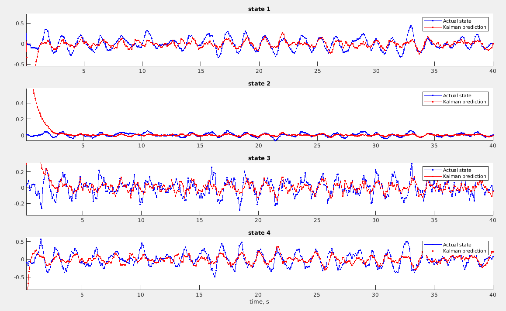
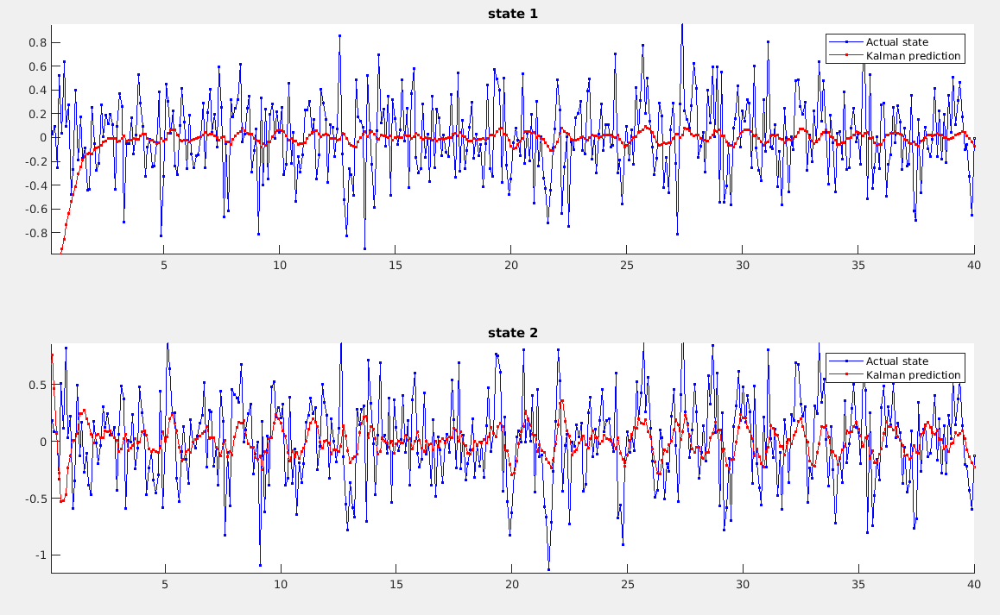

# Kalman filtering Lab
The modelisation of the system is given by the following state space model:
$$
\textbf{X}_{k+1} = F_k \textbf{X}_k + G_k \textbf{U}_k 
$$
And the observation model is given by:
$$
\textbf{Y}_k = H_k \textbf{X}_k + \textbf{B}_k
$$ 

Results of the Kalman filtering lab (state space modelisation with zero mean noise) are shown below.

## Estimation of the state vector

## Estimation of the observation vector

